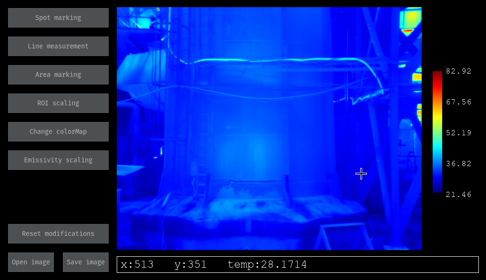
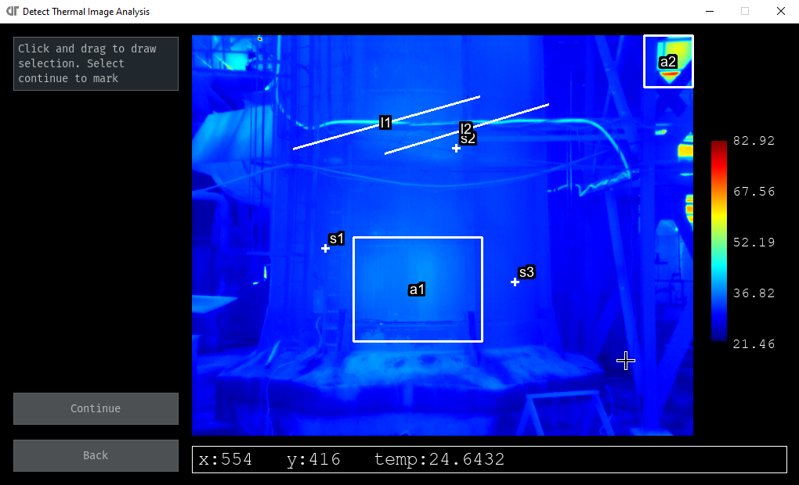
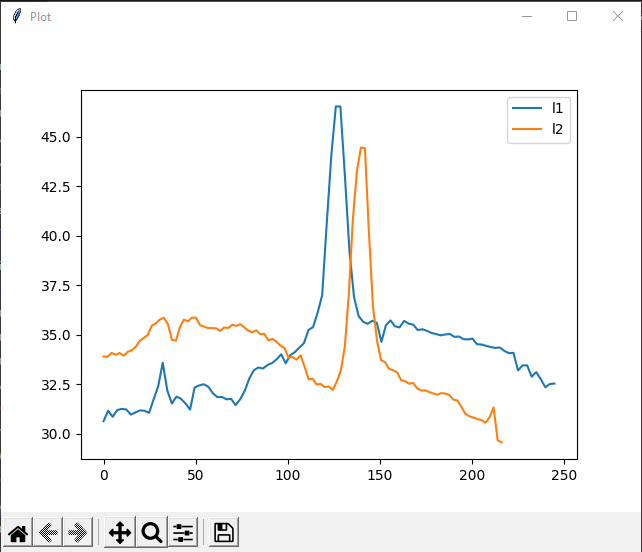
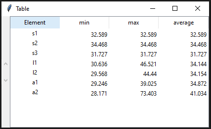
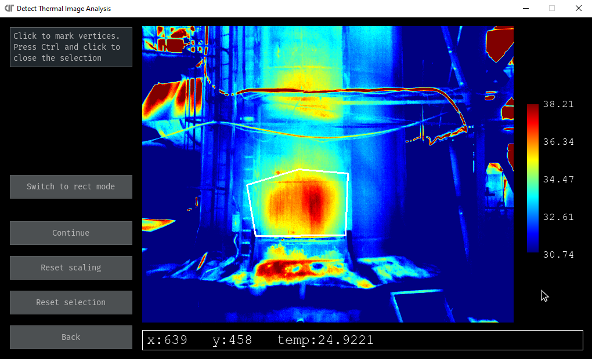
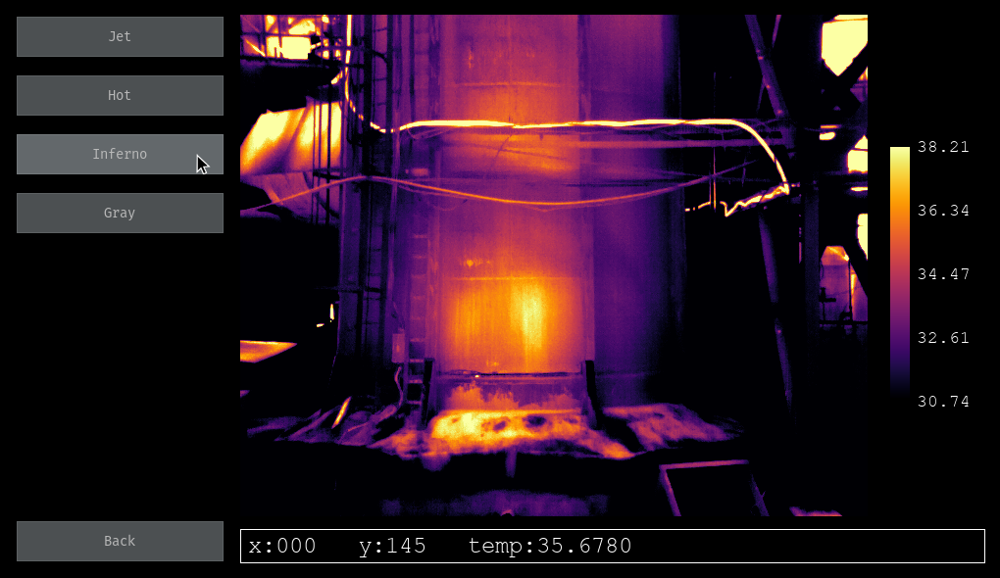
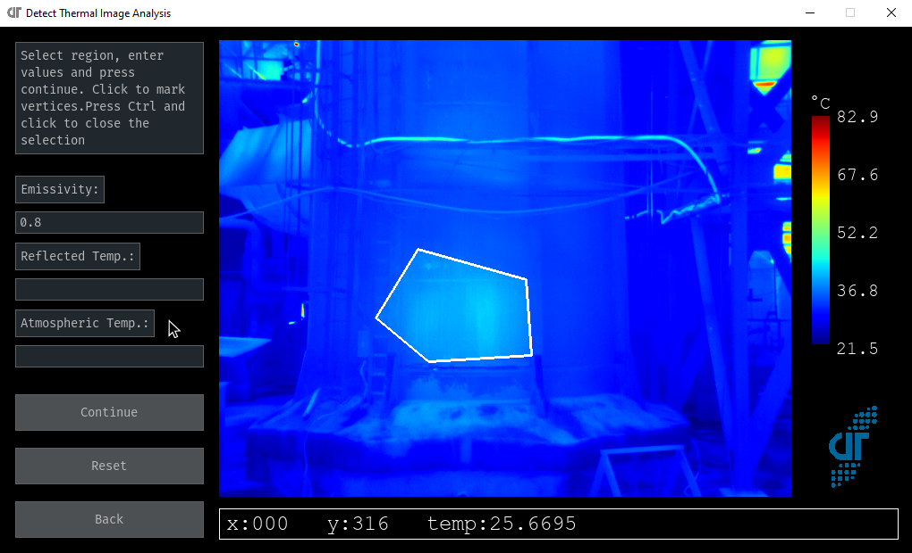

# Thermal Image Analysis
A tool for analyzing and annotating thermal images.
 - `main.py` contains code for GUI and canvas tools.
 - `utils.py` contains code for auxiliary functions.

## Features

 Main menu

### Spot marking, line measurement and area marking

- Extract the temperature values at marked spots
- Plot temperature values along the marked line(s)
- Get min, max and average values of marked regions

Generates a plot for line plots and a table for measurements in the marked regions.

 Markings on the image.

    
    
     Plots and measurements.

### ROI scaling
Scale the entire image based on values in the marked region. Use to enhance low contrast areas.

 ROI scaling interface.

### Change colormap
Change rgb colormap to one of the following options:

 Change colormap.

### Emissivity scaling
Change reflected apparent temperature and emissivity of marked region.

 Emissivity scaling interface.

### Save data
Image can be saved with or without markings, plots and values. Custom savefile(.pkl) saves all data and can be used to revive the previous session.

## Installation
 - Run installation once with `pip install -r requirements.txt`
 - Install [exiftool](https://exiftool.org/install.html)

## Usage
 - Run the program with `python main.py`
 - Select the original thermal image file or the custom saved `.pkl` file. (Find some samples in `sample_images`)
 